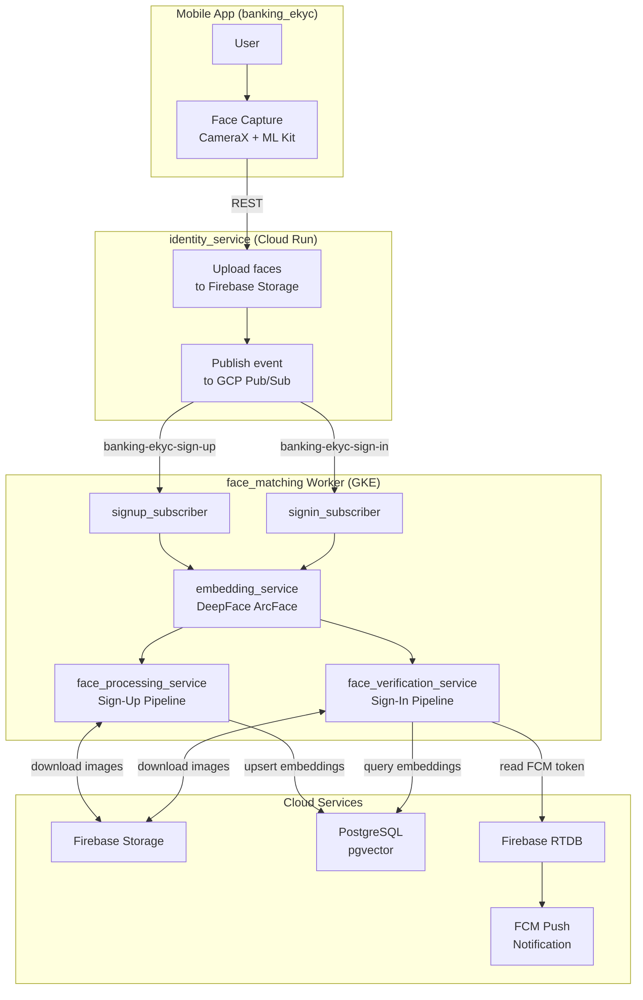
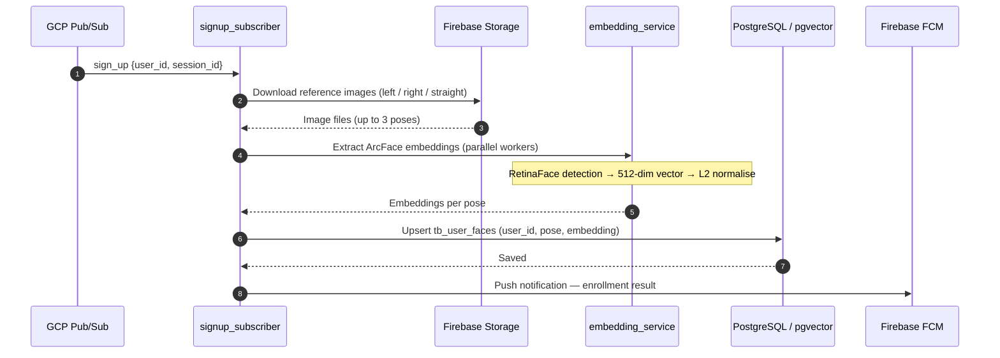
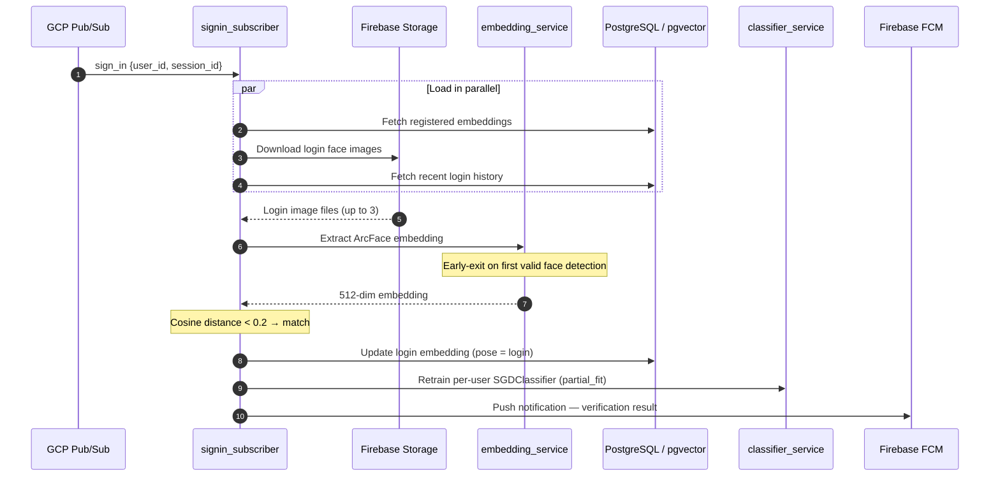

# Face Matching

> A GCP Pub/Sub worker service for biometric face enrollment and verification — part of the **banking eKYC** ecosystem. Extracts 512-dimensional **ArcFace** embeddings via DeepFace, stores them in PostgreSQL with **pgvector**, and delivers real-time sign-up / sign-in results via Firebase Cloud Messaging.

[](https://www.python.org/)
[](https://github.com/serengil/deepface)
[](https://www.tensorflow.org/)
[](https://github.com/pgvector/pgvector)
[](https://cloud.google.com/pubsub)
[](https://firebase.google.com/)
[](https://cloud.google.com/kubernetes-engine)

---

## Table of contents

- [Face Matching](#face-matching)
  - [Table of contents](#table-of-contents)
  - [Overview](#overview)
  - [Features](#features)
  - [Architecture](#architecture)
  - [Flow walkthrough](#flow-walkthrough)
    - [Sign-up enrollment](#sign-up-enrollment)
    - [Sign-in verification](#sign-in-verification)
  - [CLI commands](#cli-commands)
  - [Configuration](#configuration)
  - [Setup &amp; build](#setup--build)
    - [Prerequisites](#prerequisites)
    - [Local development](#local-development)
    - [Docker](#docker)
    - [Kubernetes / GKE](#kubernetes--gke)
  - [Project structure](#project-structure)

---

## Overview

`face_matching` is an asynchronous PubSub worker that handles the face recognition backend for a banking eKYC platform. It listens to two GCP Pub/Sub subscriptions — one for user sign-up enrollment and one for sign-in verification — and processes each event end-to-end: downloading face images from Firebase Storage, extracting ArcFace embeddings, persisting them to a PostgreSQL database with pgvector, and pushing the result back to the mobile client via Firebase Cloud Messaging. It is designed to run as two independent, horizontally scalable deployments on Google Kubernetes Engine.

## Features

- **ArcFace face embedding** — extracts 512-dimensional embeddings using DeepFace with RetinaFace detection; L2-normalises and optionally averages across multiple reference images
- **pgvector cosine similarity** — stores and queries embeddings in PostgreSQL using the pgvector extension; configurable distance threshold (default 0.2)
- **Per-user personalisation** — trains a lightweight SGDClassifier per user using registered embeddings plus synthetically generated negatives; supports online `partial_fit` updates on each successful sign-in
- **Multi-pose sign-up** — downloads up to three reference poses (left / right / straight) from Firebase Storage in parallel and processes them with configurable embedding workers
- **Firebase integration** — reads face images from Firebase Storage, retrieves FCM tokens from Firebase Realtime Database, and delivers push notifications via Firebase Cloud Messaging
- **Local ensemble mode** — offline dual-model matching (ArcFace × 0.5 + Facenet512 × 0.3 + Classifier × 0.2) for development and testing without a live PubSub connection
- **GKE-ready Docker image** — multi-stage build with model pre-warming; deploys as two independent `Deployment` objects (`face-matching-signup` / `face-matching-signin`)

## Architecture



## Flow walkthrough

### Sign-up enrollment



Key files: `app/subscriber/signup_subscriber.py`, `app/service/face_processing_service.py`, `app/service/embedding_service.py`

### Sign-in verification



Key files: `app/subscriber/signin_subscriber.py`, `app/service/face_verification_service.py`, `app/service/classifier_service.py`

## CLI commands

Run with `python -m app.main <command>`:

| Command | Description |
| :--- | :--- |
| `worker-signup` | Start the sign-up PubSub subscriber (streaming pull) |
| `worker-signin` | Start the sign-in PubSub subscriber (streaming pull) |
| `process <user_id>` | Manually re-process enrollment for a specific user UUID |
| `match` | Run local ensemble matching against images in `image/test/` |
| `retrain` | Retrain and persist the local SGDClassifier to `data/classifier.pkl` |
| `enroll img1 img2 …` | Enroll additional reference images into the local reference store |

## Configuration

Copy the example and fill in your credentials:

```bash
cp config.yaml.example config.yaml
```

```yaml
project_name: face_matching

database:
  user: postgres
  password: secret
  db: ekyc
  host: localhost
  port: 5432

gcp:
  project_id: my-gcp-project

pubsub:
  signup_subscription: face-signup-sub
  signin_subscription: face-signin-sub
  max_messages: 10
  ack_deadline_seconds: 600

firebase:
  credentials_path: firebase_credentials.json
  bucket_name: my-project.appspot.com
  rtdb_url: https://my-project-default-rtdb.firebaseio.com

embedding:
  model_name: ArcFace           # face model (ArcFace | Facenet512)
  detector_backend: retinaface  # face detector
  vector_dimension: 512
  enforce_detection: true
  warmup: true
  workers: 2

signin:
  distance_threshold: 0.2       # cosine distance cutoff for a match
  personalization_enabled: true
  personalization_max_embeddings: 5
  update_login_embedding: true
```

> Environment variables override any YAML key — useful for injecting secrets in Kubernetes without modifying the config file.

## Setup &amp; build

### Prerequisites

- **Python 3.12** — see `.python-version`
- **uv** — fast Python package manager (`pip install uv`)
- **PostgreSQL** with the `pgvector` extension enabled
- **GCP service account** with Pub/Sub Subscriber and Storage Object Viewer roles
- **Firebase service account** JSON (`firebase_credentials.json`) with Admin SDK access

### Local development

```bash
# 1. Clone and enter the project
git clone <repo-url>
cd face_matching

# 2. Create your config
cp config.yaml.example config.yaml
# Edit config.yaml with your credentials

# 3. Install dependencies
uv sync --dev

# 4. Start a subscriber
python -m app.main worker-signup
# or
python -m app.main worker-signin
```

### Docker

```bash
# Build the image
docker build -t face-matching .

# Run with mounted secrets
docker run \
  -v $(pwd)/config.yaml:/app/secrets/config.yaml \
  -v $(pwd)/firebase_credentials.json:/app/secrets/firebase_credentials.json \
  -e CONFIG_PATH=/app/secrets/config.yaml \
  -e FIREBASE_CREDENTIALS_PATH=/app/secrets/firebase_credentials.json \
  face-matching
```

> The image pre-warms the ArcFace model at startup to eliminate cold-start latency on the first inference.

### Kubernetes / GKE

The `.github/workflows/deploy.yml` pipeline handles the full deploy cycle:

1. Lint with `ruff check` + `ruff format`
2. Build and push the Docker image to Google Artifact Registry
3. Create Kubernetes secrets from `config.yaml` and `firebase_credentials.json`
4. Roll out `face-matching-signup` and `face-matching-signin` deployments in parallel

Deployment manifests live in the external `gke_banking_ekyc` repository.

## Project structure

```text
face_matching/
├── app/
│   ├── main.py                          # CLI entry point (6 commands)
│   ├── core/
│   │   ├── config.py                    # YAML + env-var config loader
│   │   ├── constants.py                 # Event enums (SIGN_UP, SIGN_IN)
│   │   └── database.py                  # SQLAlchemy engine (Neon-optimised)
│   ├── model/
│   │   ├── base_model.py                # SQLModel base with UUID + timestamps
│   │   └── user_face_model.py           # tb_user_faces table (pgvector column)
│   ├── repository/
│   │   └── user_face_repository.py      # Data access layer for face records
│   ├── service/
│   │   ├── embedding_service.py         # DeepFace ArcFace extraction + L2 norm
│   │   ├── face_processing_service.py   # Sign-up enrollment pipeline
│   │   ├── face_verification_service.py # Sign-in cosine-distance matching
│   │   ├── classifier_service.py        # Per-user SGDClassifier (partial_fit)
│   │   ├── matching_service.py          # Local ensemble (ArcFace + Facenet512)
│   │   ├── reference_store.py           # Multi-reference embedding cache
│   │   ├── storage_service.py           # Firebase Storage image downloader
│   │   └── notification_service.py      # FCM push notification sender
│   └── subscriber/
│       ├── signup_subscriber.py         # PubSub streaming pull — sign-up
│       └── signin_subscriber.py         # PubSub streaming pull — sign-in
├── docs/
│   └── FCM_NOTIFICATION.md              # Mobile integration guide (FCM payloads)
├── .github/workflows/
│   ├── ci.yml                           # Ruff lint check on every push
│   └── deploy.yml                       # Build → push → GKE rollout
├── config.yaml.example                  # Configuration template
├── Dockerfile                           # Multi-stage build with model pre-warming
├── pyproject.toml                       # Package metadata (uv, ruff)
└── README.md
```

---

Built with care by **Linh** • package `face-matching` v0.2.0
